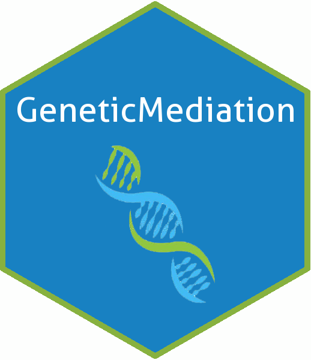

# GeneticMediation 

## Overview

`GeneticMediation` provides methods for conducting causal mediation analysis on data from the ROSMAP study.

It also provides methods for cleaning, matching, and preparing the data for analysis.

## Installation

You can install `GeneticMediation` from [GitHub](https://github.com/)
with:

``` r
# install.packages("devtools")
devtools::install_github("tydarnell/GeneticMediation")
```
