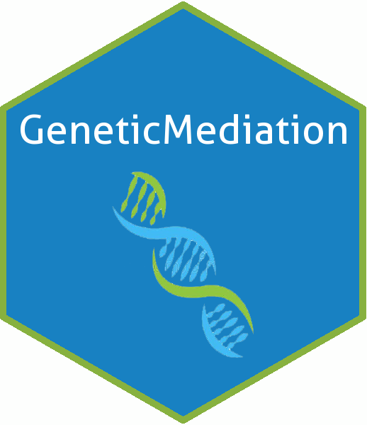

# GeneticMediation 

## Overview

`GeneticMediation` was created as part of the [UNC Wu Lab](http://diwulab.web.unc.edu/) project **Constructing Causal Mediation Pathways For Multi-Level Genomic Data**

`GeneticMediation` provides methods for cleaning and processing data from the [ROSMAP](https://www.synapse.org/#!Synapse:syn3219045) study and preparing it for causal mediation analysis.

The documentation pdf can be viewed [here](https://tydarnell.github.io/GeneticMediation_1.1.0.pdf)

## Installation

You can install `GeneticMediation` from [GitHub](https://github.com/)
with:

``` r
# install.packages("devtools")
devtools::install_github("tydarnell/GeneticMediation")
```
## Prerequisites

``` r
####################################################################################
#   
#   Software:--------------------------------------------------------
#
#     R version >= 3.6.1
#     devtools (to install GeneticMediation package from github)
#     Rstudio  (highly recommended)
#
#   Data:------------------------------------------------------------
#
#     ROSMAP Study:**************************************************
#       ReadCounts.csv   
#       H3K9acDomains.csv 
#
#     UNC Wu Lab:********************************************************
#       snps.txt
#       JulyselGeneBySNP.1030.RData
#       mediator_chr#_new.RData (each chr has a separate RData file)
#
####################################################################################
```
## Data Access

* The [ROSMAP](https://www.synapse.org/#!Synapse:syn3219045) data can be obtained from [Synapse](https://www.synapse.org/#!Synapse:syn3219045). Read instructions for [data access](https://adknowledgeportal.synapse.org/DataAccess/Instructions)

* The [UNC Wu Lab](http://diwulab.web.unc.edu/) data requires permission from Dr. Di Wu

## Setup

1)  Create an Rproject in Rstudio

2)  Install and load `GeneticMediation` from
    [GitHub](https://github.com/) with:

<!-- end list -->

``` r
# devtools::install_github("tydarnell/GeneticMediation")
library(GeneticMediation)
```

3)  Create the data folder as a subdirectory of your Rproject folder
    with:

<!-- end list -->

``` r
GeneticMediation::make_folder("data")
```

4)  Put all data except for the `mediator_chr#_new.RData` files in the
    data folder

5)  Create the mediator folder with:

<!-- end list -->

``` r
GeneticMediation::make_folder("data/mediator") #subdirectory of data folder
```

6)  Put the `mediator_chr#_new.RData` files in the mediator folder

7)  Create the results folder as a subdirectory of your Rproject folder
    with:

<!-- end list -->

``` r
GeneticMediation::make_folder("results") 
```

